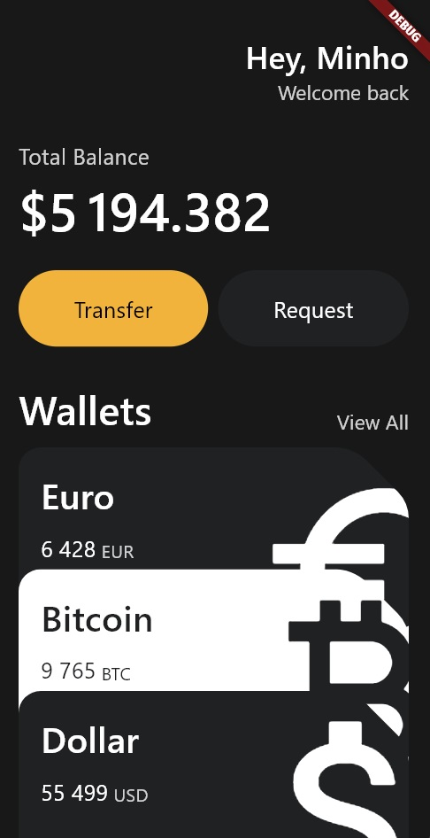

# Custom Widgets Flutter Project(Wallet UI with CustomCard)

This project demonstrates how to create a Flutter application with custom widgets, including `a card with a folded corner`, a button, and a vertical stack of cards. The project is structured to separate the main application logic and custom widgets into different files for better maintainability.

## Directory Structure

```plaintext
project/
├── lib/
│   ├── main.dart
│   └── widgets/
│       ├── custom_card.dart
│       ├── button.dart
│       └── vertical_stack.dart
```

## Files Overview

### `main.dart`

The main entry point of the application. It sets up the visual layout, including a welcome message, total balance, buttons, and a list of wallet cards.

#### Key Features:

- Uses a `SingleChildScrollView` to make the content scrollable.
- Displays a welcome message and total balance.
- Contains two buttons: "Transfer" and "Request".
- Displays a vertical stack of custom cards representing different currencies.

### `custom_card.dart`

Defines the `CustomCard` widget, which represents a card with a folded corner, displaying currency information and an icon.

#### Key Features:

- `ClipPath` widget to clip the card using a custom path defined by `FoldedCornerClipper`.
- Custom clipper class `FoldedCornerClipper` to create a folded corner effect.
- Displays currency information and an icon.

### `button.dart`

Defines the `Button` widget, a stylized button with customizable text and colors.

#### Key Features:

- Uses a `Container` with rounded corners and padding.
- Displays the button text with specified colors and font size.

### `vertical_stack.dart`

Defines the `VerticalStack` widget, which arranges custom cards vertically with an offset to create a stack effect.

#### Key Features:

- Uses `Transform.translate` to position the cards with a vertical offset.


## Usage
1. Clone the Repository:
```bash
git clone https://github.com/minhosong88/flutter_intro_wallet_UI.git
```
2. Navigate to the Project Directory:

```bash
cd flutter_intro_wallet_UI
```
3. Open the Project in Your Preferred Flutter IDE (e.g., VS Code, Android Studio):

4. Run the Application:

```bash
flutter run
```

## ScreenShot


## Contact Information

For any questions or feedback, please contact:

- **Name:** Minho Song
- **Email:** hominsong@naver.com
- **GitHub:** [minhosong88](https://github.com/minhosong88)
